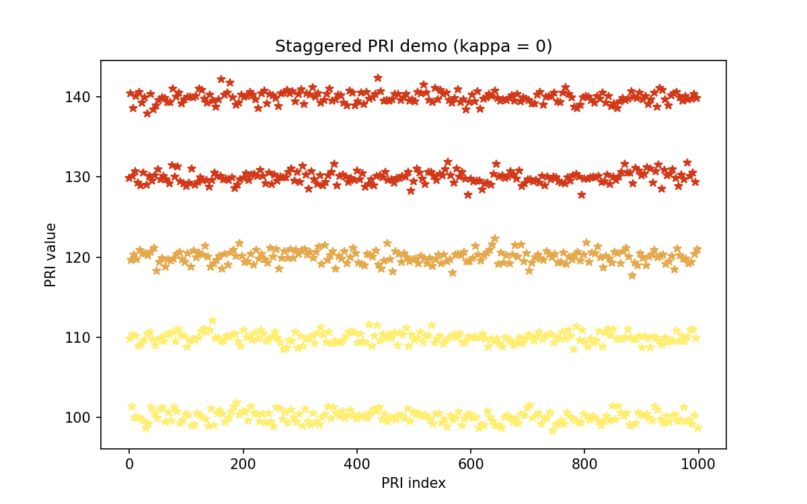
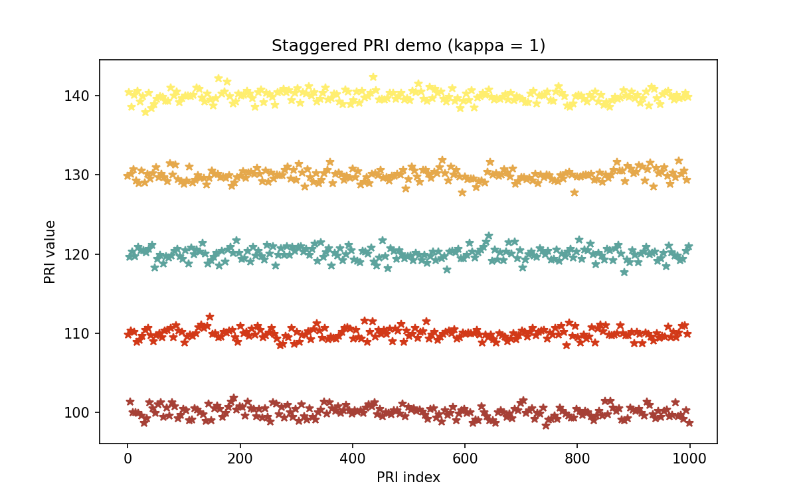

# DEMO of agile BNP-HMM
This demo is aim to implement the PE task of paper "Online Parameter Estimation and Change Point Detection for Multi-function Radar Pulse Sequence Based on the Bayesian Non-parametric HMM"
## 1. requirements
the implementation of the agile BNP-HMM requires following packages
1. numpy == 1.21.5
2. scipy == 1.7.3
3. matplotlib == 3.5.1
4. python == 3.6
## 2. commond line
run the following commond in the commond line
```
    python main.py
```
## 3. partial results
Note that the following parameters cluster results are calculated without the inilization step.
### 1) the parameter cluster result of the pulse sequence when $\kappa=0$

### 2) the parameter cluster result of the pulse sequence when $\kappa=1$


# 4. statement
1. this work is accomplished under the supervision of Shafei Wang, Yunjie Li, and Mengtao Zhu.
2. The purpose of these codes are for supporting the manuscript "Online Parameter Estimation and Change Point Detection for Multi-function Radar Pulse Sequence Based on the Bayesian Non-parametric HMM".

